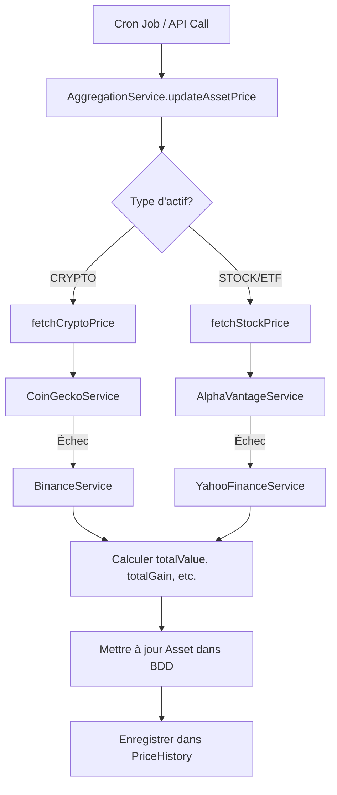

# Module Aggregation - Documentation

Ce module gère la récupération automatique des prix des actifs depuis différentes sources externes (APIs).

## 📊 Vue d'ensemble

Le module Aggregation connecte plusieurs APIs financières pour obtenir des prix en temps réel :

### Pour les Cryptomonnaies 🪙
- **CoinGecko** (primaire) - 10,000+ cryptos
- **Binance** (backup) - Prix en temps réel

### Pour les Actions & ETF 📈
- **Alpha Vantage** (primaire) - NYSE, NASDAQ, marchés internationaux
- **Yahoo Finance** (backup) - Couverture mondiale

## 🏗️ Architecture

```
AggregationService (orchestrateur)
├── CoinGeckoService (crypto)
├── AlphaVantageService (stocks/ETF)
├── BinanceService (crypto backup)
├── YahooFinanceService (stocks backup)
└── PriceHistoryService (historique BDD)
```

### Logique de Fallback

```
CRYPTO:
  1. CoinGecko → 2. Binance → ❌

STOCK/ETF:
  1. Alpha Vantage → 2. Yahoo Finance → ❌
```

## 📝 Services Disponibles

### 1. CoinGeckoService

```typescript
// Prix simple
const price = await coinGeckoService.getSimplePrice('BTC', 'eur');
// Retourne: 45234.50

// Prix détaillé
const data = await coinGeckoService.getPrice('ETH', 'eur');
// Retourne: { symbol, name, price, priceChange24h, marketCap, ... }

// Prix multiples
const prices = await coinGeckoService.getPrices(['BTC', 'ETH'], 'eur');
// Retourne: Map<string, CryptoPriceDto>

// Historique
const history = await coinGeckoService.getHistoricalPrice('BTC', 30);
// Retourne: Array<{ timestamp, price }>

// Recherche
const results = await coinGeckoService.searchCoin('bitcoin');
```

**Caractéristiques :**
- ✅ 10,000+ cryptomonnaies supportées
- ✅ Mapping automatique symbole → ID CoinGecko
- ✅ Support clé API (gratuit ou payant)
- ⚠️ Rate limit: 10-50 calls/min (gratuit)

### 2. AlphaVantageService

```typescript
// Prix actuel
const quote = await alphaVantageService.getPrice('AAPL');
// Retourne: { symbol, price, open, high, low, change, volume, ... }

// Prix intraday (pour graphiques)
const intraday = await alphaVantageService.getIntradayPrices('AAPL', '5min');

// Historique journalier
const daily = await alphaVantageService.getDailyPrices('AAPL', 'compact');

// Recherche
const results = await alphaVantageService.search('Apple');

// Infos entreprise
const overview = await alphaVantageService.getCompanyOverview('AAPL');
```

**Caractéristiques :**
- ✅ Données temps réel
- ✅ NYSE, NASDAQ, marchés internationaux
- ✅ Support actions françaises (ex: TTE.PA)
- ⚠️ Rate limit: 5 calls/min (gratuit)
- 🔧 Rate limiting automatique intégré

### 3. BinanceService

```typescript
// Prix simple
const price = await binanceService.getSimplePrice('BTC', 'EUR');

// Prix détaillé
const data = await binanceService.getPrice('ETH', 'EUR');

// Prix multiples
const prices = await binanceService.getPrices(['BTC', 'ETH'], 'EUR');

// Historique (klines)
const history = await binanceService.getHistoricalPrices('BTC', 'EUR', '1d', 30);

// Vérifier si une paire existe
const exists = await binanceService.isPairAvailable('BTC', 'EUR');
```

**Caractéristiques :**
- ✅ Gratuit, sans clé API
- ✅ Pas de rate limit
- ✅ Données en temps réel
- ✅ Support EUR, USD, USDT, etc.

### 4. YahooFinanceService

```typescript
// Prix actuel
const quote = await yahooFinanceService.getPrice('GOOGL');

// Prix multiples
const prices = await yahooFinanceService.getPrices(['AAPL', 'GOOGL']);

// Historique
const history = await yahooFinanceService.getHistoricalPrices(
  'AAPL',
  new Date('2024-01-01'),
  new Date(),
  '1d'
);

// Recherche
const results = await yahooFinanceService.search('Tesla');

// Résumé détaillé
const summary = await yahooFinanceService.getQuoteSummary('TSLA');
```

**Caractéristiques :**
- ✅ Gratuit, sans clé API
- ✅ Couverture mondiale
- ✅ Historique long (20+ ans)
- ✅ Pas de rate limit strict

### 5. PriceHistoryService

```typescript
// Enregistrer un prix
await priceHistoryService.recordPrice(assetId, 45000, 'COINGECKO');

// Récupérer l'historique
const history = await priceHistoryService.getPriceHistory(assetId, 30);
// Retourne: Array<{ recordedAt, price, source }>

// Dernier prix enregistré
const latest = await priceHistoryService.getLatestPrice(assetId);

// Statistiques
const stats = await priceHistoryService.getPriceStatistics(assetId, 30);
// Retourne: { current, min, max, avg, changePercent }

// Nettoyage (supprime prix > 365 jours)
const deleted = await priceHistoryService.cleanOldHistory(365);
```

### 6. AggregationService (Service Principal)

```typescript
// Mettre à jour un actif
const result = await aggregationService.updateAssetPrice(assetId);
// Retourne: { success: true, price: 45000 }

// Mettre à jour plusieurs actifs
const results = await aggregationService.updateAssetsPrices([id1, id2]);
// Retourne: { success: 2, failed: 0, details: [...] }

// Mettre à jour tous les actifs
const all = await aggregationService.updateAllAssets();

// Rechercher un actif
const results = await aggregationService.searchAsset('bitcoin', 'CRYPTO');
```

## 🔌 Endpoints API

### POST /api/v1/aggregation/update/:assetId

Mettre à jour le prix d'un actif spécifique.

**Réponse :**
```json
{
  "success": true,
  "price": 45234.50
}
```

### POST /api/v1/aggregation/update-bulk

Mettre à jour plusieurs actifs en une fois.

**Body :**
```json
{
  "assetIds": ["asset-id-1", "asset-id-2"]
}
```

**Réponse :**
```json
{
  "success": 2,
  "failed": 0,
  "details": [
    { "assetId": "asset-id-1", "success": true, "price": 45000 },
    { "assetId": "asset-id-2", "success": true, "price": 3000 }
  ]
}
```

### POST /api/v1/aggregation/update-all

Mettre à jour tous les actifs trackables (admin).

### GET /api/v1/aggregation/search

Rechercher des actifs dans toutes les APIs.

**Query params :**
- `query` (required): Symbole ou nom
- `type` (optional): CRYPTO | STOCK

**Exemple :**
```
GET /api/v1/aggregation/search?query=bitcoin&type=CRYPTO
```

### GET /api/v1/aggregation/history/:assetId

Récupérer l'historique des prix d'un actif.

**Query params :**
- `days` (optional): Nombre de jours (default: 30)

**Réponse :**
```json
[
  { "recordedAt": "2024-11-01T10:00:00Z", "price": 44000, "source": "COINGECKO" },
  { "recordedAt": "2024-11-01T14:00:00Z", "price": 44500, "source": "COINGECKO" }
]
```

### GET /api/v1/aggregation/statistics/:assetId

Statistiques de prix pour un actif.

**Query params :**
- `days` (optional): Nombre de jours (default: 30)

**Réponse :**
```json
{
  "current": 45234.50,
  "min": 42000,
  "max": 47000,
  "avg": 44500,
  "changePercent": 7.5
}
```

## ⏰ Cron Jobs

### 1. Mise à jour automatique des prix

**Fréquence :** Toutes les 4 heures
**Cron :** `0 */4 * * *`

```typescript
@Cron(CronExpression.EVERY_4_HOURS)
async scheduledPriceUpdate()
```

Met à jour automatiquement tous les actifs actifs avec un symbole défini.

**Configuration :**
```env
ENABLE_PRICE_UPDATES=true
```

### 2. Nettoyage de l'historique

**Fréquence :** Tous les jours à 3h du matin
**Cron :** `0 3 * * *`

```typescript
@Cron('0 3 * * *')
async scheduledHistoryCleanup()
```

Supprime les enregistrements de prix de plus de 365 jours.

## 🔧 Configuration (.env)

```env
# CoinGecko
COINGECKO_API_KEY=CG-XXXXXXXXXXXXXXXXXXXXXXXX
COINGECKO_API_URL=https://api.coingecko.com/api/v3

# Alpha Vantage
ALPHA_VANTAGE_API_KEY=YOUR_API_KEY_HERE
ALPHA_VANTAGE_API_URL=https://www.alphavantage.co/query

# Binance (backup crypto - pas de clé nécessaire)
BINANCE_API_URL=https://api.binance.com/api/v3
BINANCE_ENABLED=true

# Yahoo Finance (backup stocks - pas de clé nécessaire)
YAHOO_FINANCE_ENABLED=true

# Cron jobs
ENABLE_PRICE_UPDATES=true
PRICE_UPDATE_CRON=0 */4 * * *
```

## 📊 Flux de Mise à Jour des Prix



## 🧪 Tests

### Tester un service individuellement

```typescript
// test/aggregation/coingecko.service.spec.ts
describe('CoinGeckoService', () => {
  it('should fetch Bitcoin price', async () => {
    const price = await coinGeckoService.getSimplePrice('BTC', 'eur');
    expect(price).toBeGreaterThan(0);
  });
});
```

### Tester l'agrégation complète

```bash
# Via l'API
curl -X POST http://localhost:3000/api/v1/aggregation/update/ASSET_ID \
  -H "Authorization: Bearer YOUR_TOKEN"
```

## ⚠️ Gestion des Erreurs

Toutes les méthodes des services gèrent les erreurs de manière robuste :

```typescript
// En cas d'échec, retourne null au lieu de throw
const price = await coinGeckoService.getSimplePrice('INVALID');
// price === null

// Les logs d'erreur sont automatiquement générés
// [CoinGeckoService] Failed to fetch price for INVALID: ...
```

## 📈 Rate Limiting

### CoinGecko
- **Gratuit :** 10-50 calls/min
- **Pro :** Jusqu'à 500 calls/min
- Pas de rate limiting automatique (délai 30s sur données gratuites)

### Alpha Vantage
- **Gratuit :** 5 calls/min, 500/jour
- **Rate limiting automatique :** 12 secondes entre chaque appel
- Premium : Jusqu'à 1200 calls/min

### Binance
- Pas de limite stricte pour les endpoints publics
- ~1200 requêtes/min recommandé

### Yahoo Finance
- Pas de limite officielle
- Utilisation raisonnable recommandée

## 🚀 Performance

### Optimisations Implémentées

1. **Fallback automatique** : Si un service échoue, bascule sur le backup
2. **Rate limiting** : Respect automatique des limites d'API
3. **Batch updates** : Mise à jour multiple en une fois
4. **Caching** : PriceHistory évite de refaire les mêmes appels
5. **Async** : Toutes les opérations sont asynchrones

### Benchmarks (estimé)

| Opération | Temps moyen |
|-----------|-------------|
| 1 prix crypto (CoinGecko) | ~200ms |
| 1 prix stock (Alpha Vantage) | ~500ms |
| 100 actifs (bulk) | ~5-10 min |
| Historique 30j | ~100ms (depuis BDD) |

## 🔮 Prochaines Améliorations

- [ ] Cache Redis pour les prix (éviter appels répétés)
- [ ] WebSocket temps réel (Binance, Kraken)
- [ ] Support des indices (CAC40, S&P500)
- [ ] API pour montres (Chrono24) et voitures (Hemmings)
- [ ] Alertes en temps réel sur changements de prix
- [ ] Prédictions ML basées sur l'historique

## 📚 Ressources

- [CoinGecko API Docs](https://docs.coingecko.com/reference/introduction)
- [Alpha Vantage API Docs](https://www.alphavantage.co/documentation/)
- [Binance API Docs](https://binance-docs.github.io/apidocs/spot/en/)
- [Yahoo Finance API (unofficial)](https://github.com/gadicc/node-yahoo-finance2)

---

Créé le : 2025-11-05
Module : backend/src/modules/aggregation
